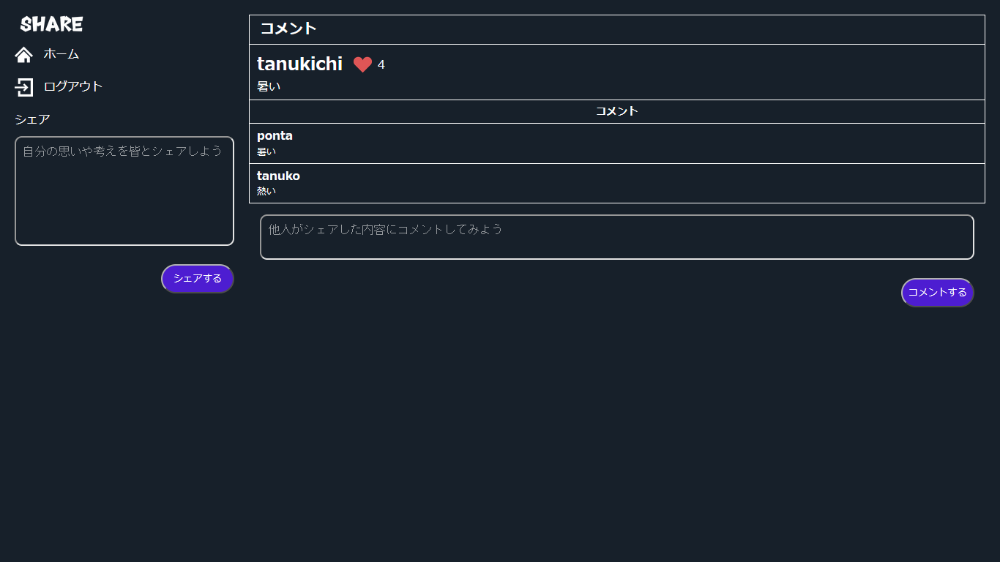
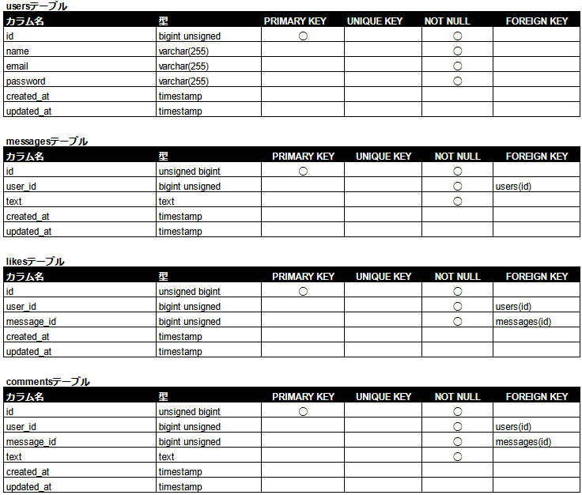
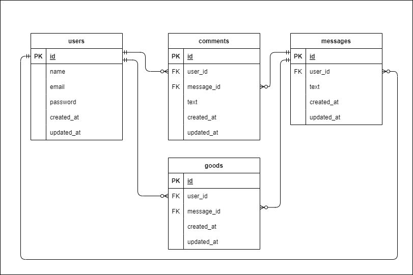

# Twitter風SNSアプリケーション
Twitter風SNSアプリ

## 作成した目的

何気ないことをつぶやくことができるTwitter風SNSアプリを作成する。

## アプリケーション URL

### ローカル環境

- アプリケーション URL：http://localhost/
- phpMyAdmin：http://localhost:8080/

## 他のリポジトリ

なし

## 機能一覧

| 項目                         | 備考                                                                                                                                                                                                                                                                                                                                                                  |
| ---------------------------- | --------------------------------------------------------------------------------------------------------------------------------------------------------------------------------------------------------------------------------------------------------------------------------------------------------------------------------------------------------------------- |
| 会員登録                     | 会員登録ページから会員登録ができる。                                                                                                                                                                                                                                                                                                                                  |
| ログイン                     | ログインページからログインができる。                                                                                                                                                                                                                                                                                                                                  |
| ログアウト                   | メニューからログアウトを選択することで認証情報をクリアできる。                                                                                                                                                                                                                                                                                                        |
| 投稿の一覧表示               | ホーム画面で投稿（投稿者およびメッセージ）の一覧を表示できる。                                                                                                                                                                                                                                                                                |
| 投稿                         | メッセージを投稿できる                                                                                                                                                                                                                                                                                                          |
| 投稿の削除                   | 投稿したメッセージを削除できる                                                                                                                                                                                                                                            |
| 投稿への"いいね！"機能                 |    気に入った投稿に"いいね！"ができる。 また、"いいね！"の解除ができる。                                                                                                                                                                                                                                                                                                       |
| 投稿へのコメント機能         | 投稿にコメントができる。                                                                                                                                                                                                                                                                                                          |

## 使用技術(実行環境)

- PHP 8.2.19
- Laravel 9.52.16
- MySQL 8.0.26
- nginx 1.21.1
- fortify 1.19.1
- react 18.3.1
- vite 4.5.3

## テーブル定義

## ER 図

## 環境構築

### Docker ビルド

1. プロジェクトを取得 (terminal)  
   `git clone {URL}`
2. コンテナの作成、実行 (terminal)  
   `docker-compose up -d --build`

＊ MySQL は、OS によって起動しない場合があるのでそれぞれの PC に合わせて、docker-compose.yml ファイルを編集してください。

### 環境構築

1. PHP コンテナに入る (terminal)  
   `docker-compose exec php bash`
2. ライブラリのインストール (PHP)  
   `composer install`
3. .env.example ファイルから.env を作成し、環境変数を変更(terminal)
   - "docker-compose.yml"を参考に DB の設定を修正
4. アプリケーションキーの作成 (PHP)  
   `php artisan key:generate`
5. テーブルの作成 (PHP)  
   `php artisan migrate`
6. ダミーデータの作成 (PHP)  
   `php artisan db:seed`
7. PHP コンテナから出て、srcディレクトリに移動
   `cd src`
8. ライブラリのインストール（react）
   `npm install`
9. ビルドして実行
   `npm build`
   `npm run dev`

## その他
   - テストアカウント
      メールアドレス：test@user.com
      password：password
 
